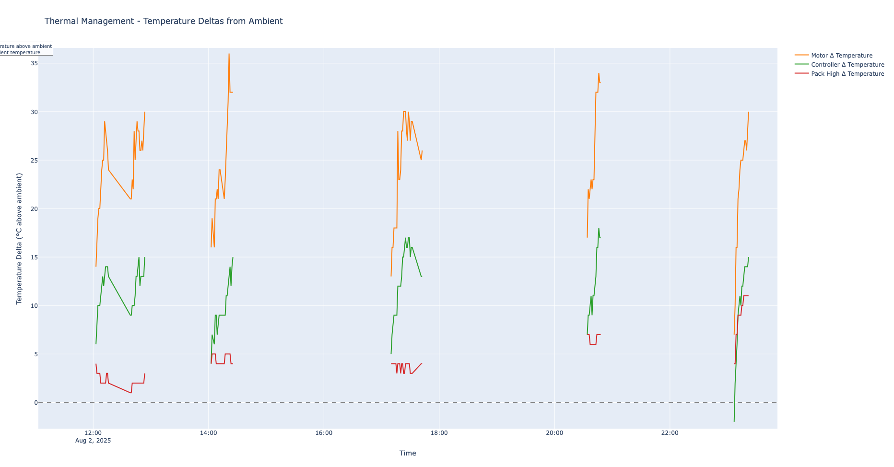
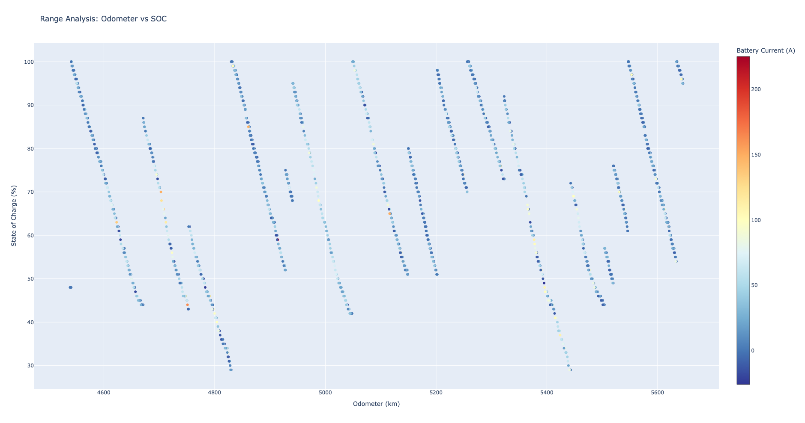
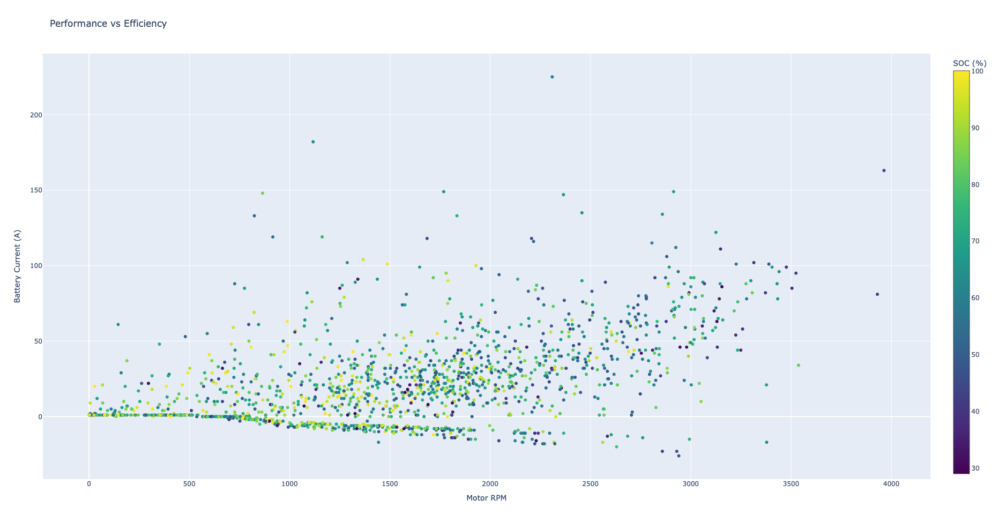

# Zero Log Parser

A modern Python package for parsing Zero Motorcycle log files with structured data extraction and multiple output formats.

This tool parses binary-encoded event logs from Zero Motorcycles' main bike board (MBB) and battery management system (BMS) into human-readable formats, emulating Zero's official log parser functionality with enhanced structured data extraction.

## Features

- **Multiple Output Formats**: Text, CSV, TSV, and JSON with structured data unnesting support
- **Interactive Data Visualization**: Generate rich HTML plots for data analysis
- **Comprehensive Time Filtering**: Filter log entries by date ranges with natural language support (`"last month"`, `"June 2025"`, precise timestamps)
- **Structured Data Extraction**: Automatically converts telemetry data to structured JSON format
- **Advanced Timezone Support**: Hour offsets (`-8`, `+1`) and named timezones (`Europe/Berlin`, `America/New_York`) with automatic DST handling
- **Modern Python Package**: Built for Python 3.10+ with type hints and modern packaging
- **CLI and Library**: Use as command-line tool or import as Python library
- **Enhanced Parsing**: Improved message parsing with descriptive event names and structured sensor data

## Installation

### From PyPI (recommended)

```bash
# Basic installation
pip install zero-log-parser

# With plotting dependencies
pip install zero-log-parser[plotting]
```

### From Source

```bash
git clone https://github.com/ilja-radusch/zero-log-parser.git
cd zero-log-parser

# Basic installation
pip install -e .

# With plotting dependencies
pip install -e ".[plotting]"
```

### For Development

```bash
git clone https://github.com/ilja-radusch/zero-log-parser.git
cd zero-log-parser
pip install -e ".[dev]"
```

## Requirements

- Python 3.10 or higher
- No external dependencies (uses only Python standard library)
- Optional: `plotly` and `pandas` for interactive plotting features

## Usage

### Getting Logs

You can extract logs from your Zero motorcycle using the [Zero mobile app](http://www.zeromotorcycles.com/app/help/ios/):

1. Download the Zero mobile app
2. Pair your motorcycle with it via Bluetooth
3. Select `Support` > `Email bike logs`
4. Enter your email address to send the logs to yourself
5. Download the attachment from the email

### Command Line Interface

The package provides multiple CLI commands: `zero-log-parser` and `zlp` (short alias) for parsing, and `zero-plotting` for interactive visualizations.

**Note**: Interactive plotting is available through the `zero-plotting` command. The main CLI (`zero-log-parser`/`zlp`) and standalone script (`zero_log_parser.py`) provide parsing functionality only.

#### Basic Usage

```bash
# Parse to text format (default)
zero-log-parser log_data/logfile.bin

# Specify output file
zero-log-parser log_data/logfile.bin -o output.txt

# Different output formats
zero-log-parser log_data/logfile.bin -f csv -o output.csv
zero-log-parser log_data/logfile.bin -f tsv -o output.tsv
zero-log-parser log_data/logfile.bin -f json -o output.json

# Structured data unnesting for CSV/TSV analysis
zero-log-parser log_data/logfile.bin -f csv --unnest -o detailed_analysis.csv

# Time filtering support (all formats)
zero-log-parser log_data/logfile.bin --start "last month" --end "today" -f csv
zero-log-parser log_data/logfile.bin --start-end "August 2025" -f json
zero-log-parser log_data/*.bin --start "2025-08-01" --end "2025-08-15" -f csv
```

#### Advanced Options

```bash
# Timezone support - Hour offsets
zero-log-parser log_data/logfile.bin --timezone -8  # PST (UTC-8)
zero-log-parser log_data/logfile.bin --timezone 1   # CET (UTC+1)

# Timezone support - Named timezones (with automatic DST handling)
zero-log-parser log_data/logfile.bin --timezone Europe/Berlin     # German timezone
zero-log-parser log_data/logfile.bin --timezone America/New_York  # US Eastern
zero-log-parser log_data/logfile.bin --timezone Asia/Tokyo        # Japan timezone
zero-log-parser log_data/logfile.bin --timezone UTC               # Coordinated Universal Time

# Multiple files with timezone
zero-log-parser log_data/*.bin --timezone Europe/London -f json

# Time filtering with timezone support
zero-log-parser log_data/*.bin --start-end "last month" --timezone Europe/Berlin -f json
zero-log-parser log_data/logfile.bin --start "July 2025" --end "August 2025" --timezone -8 -f csv
zero-log-parser log_data/*.bin --start "2025-08-01 14:30" --end "2025-08-15 18:00" -f json

# Natural language time filtering
zero-log-parser log_data/*.bin --start "last week" --end "today" -f csv
zero-log-parser log_data/logfile.bin --start-end "June 2025" -f json  # Entire month

# Verbose output
zero-log-parser log_data/logfile.bin --verbose

# Short alias with time filtering
zlp log_data/logfile.bin --start-end "last month" -f json -o filtered_data.json
```

#### Interactive Plotting

Generate rich HTML visualizations of your motorcycle data using the `zero-plotting` command:

```bash
# Make sure you have plotting dependencies installed
# Either: pip install zero-log-parser[plotting]
# Or: pip install plotly pandas

# Generate all available plots from a single file
zero-plotting log_data/logfile.bin --plot all

# Generate specific plot types
zero-plotting log_data/logfile.bin --plot battery      # Battery SOC and health
zero-plotting log_data/logfile.bin --plot power       # Power consumption analysis
zero-plotting log_data/logfile.bin --plot range       # Range estimation and efficiency
zero-plotting log_data/logfile.bin --plot performance # RPM vs efficiency analysis
zero-plotting log_data/logfile.bin --plot thermal     # Temperature monitoring
zero-plotting log_data/logfile.bin --plot voltage     # Voltage analysis
zero-plotting log_data/logfile.bin --plot charging    # Charging session & recuperation analysis
zero-plotting log_data/logfile.bin --plot balance     # Cell balance health

# Plot data from multiple log files (merged automatically)
zero-plotting log_data/file1.bin log_data/file2.bin log_data/file3.bin --plot all
zero-plotting log_data/*.bin --plot battery          # Use shell expansion for multiple files

# Timezone support in plotting
zero-plotting log_data/logfile.bin --plot thermal --timezone Europe/Berlin
zero-plotting log_data/*.bin --plot voltage --timezone America/New_York

# Specify output directory for HTML plots
zero-plotting log_data/logfile.bin --plot all --output-dir ./plots

# Time filtering examples (works with single or multiple files)
zero-plotting log_data/logfile.bin --plot thermal --start "last month"
zero-plotting log_data/file1.bin log_data/file2.bin --plot battery --start "June 2025" --end "July 2025"
zero-plotting log_data/*.bin --plot power --start "2025-06-15" --end "2025-06-20"
zero-plotting log_data/*.bin --plot range --start "last 30 days"

# Combine timezone and time filtering
zero-plotting log_data/*.bin --plot charging --start "June 2025" --timezone Europe/Berlin
zero-plotting log_data/logfile.bin --plot thermal --start "last week" --timezone America/New_York
```

**Multiple File Support:**
- All input files must be the same type (.bin or .csv)
- Files are merged intelligently with duplicate removal using LogData operators
- VIN compatibility is checked (warning shown for mismatches, force-merge if needed)
- Merged plots are named using VIN, log type and latest date: `VIN_LOGTYPE_YYYY-MM-DD_plottype.html`
- Log type prefixes: `MBB` (Main Bike Board), `BMS` (Battery Management System), `BMS+MBB` (both)
- Time filtering is applied after merging
- Fallback naming: `VIN_LOGTYPE_merged_plottype.html` (if date extraction fails)

#### Log Parsing Time Filtering

**NEW**: The main log parsing commands (`zero-log-parser`, `zlp`) now support comprehensive time filtering across all output formats:

**Time Filtering Parameters:**
- `--start TIME` - Filter entries after this time (inclusive)
- `--end TIME` - Filter entries before this time (inclusive)  
- `--start-end TIME` - Filter entries within this period (shorthand for both boundaries)

**Supported Time Formats:**
- **Natural Language**: `"last month"`, `"last week"`, `"last 30 days"`, `"today"`
- **Month/Year**: `"June 2025"`, `"December 2024"` (smart boundaries - start/end of period)
- **ISO Dates**: `"2025-06-15"`, `"2025-06-15 14:30:00"`
- **US/European**: `"06/15/2025"`, `"15/06/2025"`

**Smart Boundary Logic:**
- `--start "June 2025"` → `2025-06-01 00:00:00` (beginning of month)
- `--end "June 2025"` → `2025-06-30 23:59:59` (end of month)
- `--start "2025-06-15"` → `2025-06-15 00:00:00` (start of day)
- `--end "2025-06-15"` → `2025-06-15 23:59:59` (end of day)

**Time Filtering Examples:**
```bash
# Filter last month's entries to CSV
zero-log-parser log_data/*.bin --start-end "last month" -f csv -o last_month.csv

# Filter specific date range with timezone
zero-log-parser log_data/*.bin --start "July 2025" --end "August 2025" --timezone Europe/Berlin -f json

# Natural language filtering
zero-log-parser log_data/logfile.bin --start "last week" --end "today" -f csv

# Precise timestamp filtering
zero-log-parser log_data/*.bin --start "2025-08-01 09:00" --end "2025-08-01 17:00" -f json

# Entire month analysis
zero-log-parser log_data/logfile.bin --start-end "June 2025" -f csv

# Multiple file filtering with timezone
zero-log-parser log_data/*.bin --start-end "last 30 days" --timezone US/Pacific -f json
```

**Benefits:**
- Works with all output formats (TXT, CSV, TSV, JSON)
- Timezone-aware filtering using `--timezone` parameter
- Memory efficient - filters entries before processing
- Consistent with plotting time filtering syntax

#### Plotting Time Filtering

The `zero-plotting` command supports flexible time filtering using `--start` and `--end` parameters:

**Relative Time Formats:**
- `"last week"`, `"last month"`, `"last year"`
- `"last 7 days"`, `"last 30 days"`, `"last 3 months"`

**Specific Date Formats:**
- `"June 2025"`, `"December 2024"` (month and year)
- `"2025-06-15"`, `"2025-06-15 14:30"` (ISO format)
- `"06/15/2025"`, `"15/06/2025"` (US/EU date formats)
- `"June 15, 2025"` (natural language)

**Usage Examples:**
```bash
# Filter data from the last month only
zero-plotting log_data/logs.bin --plot thermal --start "last month"

# Filter data for a specific month with timezone
zero-plotting log_data/logs.bin --plot battery --start "June 2025" --end "July 2025" --timezone Europe/Berlin

# Filter data for a specific date range
zero-plotting log_data/logs.bin --plot power --start "2025-06-15" --end "2025-06-20"

# Filter data from a specific date until now with timezone
zero-plotting log_data/logs.bin --plot range --start "2025-06-01" --timezone America/New_York
```

#### Timezone Support

Both `zero-log-parser` and `zero-plotting` support comprehensive timezone handling:

**Default Behavior:**
- Uses your system's local timezone automatically
- MBB (Main Bike Board) timestamps are automatically adjusted from their hardcoded GMT-7 offset

**Override Options:**
```bash
# Hour offsets from UTC
zero-log-parser log_data/logfile.bin --timezone -8    # Pacific Standard Time (PST)
zero-log-parser log_data/logfile.bin --timezone 1     # Central European Time (CET)

# Named timezones (with automatic DST handling)
zero-log-parser log_data/logfile.bin --timezone Europe/Berlin      # German time
zero-log-parser log_data/logfile.bin --timezone America/New_York   # US Eastern time
zero-log-parser log_data/logfile.bin --timezone Asia/Tokyo         # Japan time
zero-log-parser log_data/logfile.bin --timezone UTC                # Universal time

# Same options work for plotting
zero-plotting log_data/*.bin --plot thermal --timezone Europe/London
```

**Common Timezone Names:**
- `UTC` - Coordinated Universal Time
- `US/Pacific`, `US/Eastern`, `US/Central`, `US/Mountain` - US time zones
- `Europe/London`, `Europe/Berlin`, `Europe/Paris` - European time zones
- `Asia/Tokyo`, `Asia/Singapore`, `Asia/Shanghai` - Asian time zones

**Benefits:**
- Accurate temporal correlation when analyzing logs from different locations
- Automatic handling of Daylight Saving Time transitions for named timezones
- Consistent time display across parsing and plotting tools

#### Help

```bash
zero-log-parser --help
zero-plotting --help
```

### Python Library

```python
from zero_log_parser import LogData, parse_log
from datetime import datetime

# Parse a log file
log_data = LogData("log_data/logfile.bin")

# Access parsed data
print(f"Entries: {log_data.entries_count}")
print(f"Header: {log_data.header_info}")

# Generate different output formats
text_output = log_data.emit_text_decoding()
json_output = log_data.emit_json_decoding()

# Or use the high-level function with timezone support
parse_log(
    bin_file="log_data/input.bin",
    output_file="output.json", 
    output_format="json",
    tz_code=-8  # PST as hour offset
)

# With named timezone and time filtering
from zero_log_parser.utils import parse_time_filter_start, parse_time_filter_end

start_time = parse_time_filter_start("last month", "Europe/Berlin")
end_time = parse_time_filter_end("today", "Europe/Berlin")

parse_log(
    bin_file="log_data/input.bin",
    output_file="filtered_output.json",
    output_format="json", 
    tz_code="Europe/Berlin",  # Named timezone
    start_time=start_time,
    end_time=end_time
)
```

### Output Formats

#### Text Format (default)
Human-readable format with intelligent structured data formatting:
```
Entry     Timestamp            Level     Event                    Conditions
00006     2025-08-03 12:42:34  DATA      Discharge level          Amp Hours: 7, State Of Charge Percent: 94%, Current Amps: 1A, Voltage Low Cell Volts: 4.05V, Pack Temp Celsius: 21°C
06499     2025-08-03 12:34:38  INFO      Contactor drive turned on  Pack V: 113.5V, Switched V: 100.1V, Duty Cycle: 35%
```
Features:
- **Structured data**: Formatted as readable key-value pairs with automatic unit detection (%, V, A, mA, mV, °C)
- **Regular conditions**: Preserved as original text
- **Smart formatting**: Snake_case keys converted to "Title Case"

#### CSV Format
Comma-separated values with JSON-encoded structured data:
```csv
entry,timestamp,log_level,message,conditions,uninterpreted
6,2025-08-03 12:42:34,DATA,Discharge level,"{""amp_hours"":7,""state_of_charge_percent"":94,""current_amps"":1,""voltage_low_cell_volts"":4.05}",
6499,2025-08-03 12:34:38,INFO,Contactor drive turned on,"Pack V:  113.5V, Switched V:  100.1V, Duty Cycle: 35%",
```

#### TSV Format  
Tab-separated values with JSON-encoded structured data:
```tsv
entry	timestamp	log_level	message	conditions	uninterpreted
6	2025-08-03 12:42:34	DATA	Discharge level	{"amp_hours":7,"state_of_charge_percent":94,"current_amps":1}	
6499	2025-08-03 12:34:38	INFO	Contactor drive turned on	Pack V:  113.5V, Switched V:  100.1V, Duty Cycle: 35%	
```

#### Structured Data Unnesting (`--unnest`)

For CSV/TSV formats, use `--unnest` to expand structured telemetry data into separate rows for enhanced analysis:

**Standard CSV/TSV Output:**
```csv
entry;timestamp;log_level;message;conditions;uninterpreted
6;2025-08-03 12:42:33;DATA;Discharge level;{"amp_hours":7,"state_of_charge_percent":94};
```

**With `--unnest` Flag:**
```csv
entry;timestamp;log_level;message;condition_key;condition_value;uninterpreted
6;2025-08-03 12:42:33;DATA;Discharge level;amp_hours;7;
6;2025-08-03 12:42:33;DATA;Discharge level;state_of_charge_percent;94;
```

Usage:
```bash
# CSV with unnesting for spreadsheet analysis
zero-log-parser logfile.bin -f csv --unnest -o analysis.csv

# TSV with unnesting for data science workflows  
zero-log-parser logfile.bin -f tsv --unnest -o dataset.tsv
```

Benefits:
- **Spreadsheet-friendly**: Each telemetry value gets its own row for easy filtering and pivot tables
- **Data analysis ready**: Perfect for Python pandas, R, or SQL import
- **Preserve relationships**: Entry metadata (timestamp, message) repeated for each key-value pair

#### JSON Format
Structured JSON with metadata and parsed telemetry:
```json
{
  "metadata": {
    "source_file": "logfile.bin",
    "log_type": "MBB",
    "total_entries": 6603
  },
  "entries": [
    {
      "entry_number": 6,
      "timestamp": "2025-08-03 12:42:34",
      "sort_timestamp": 1754217754.0,
      "log_level": "DATA",
      "event": "Discharge level",
      "conditions": null,
      "uninterpreted": null,
      "is_structured_data": true,
      "structured_data": {
        "amp_hours": 7,
        "state_of_charge_percent": 94,
        "current_amps": 1,
        "voltage_low_cell_volts": 4.05,
        "pack_temp_celsius": 21,
        "mode": "Bike On"
      }
    },
    {
      "entry_number": 6499,
      "timestamp": "2025-08-03 12:34:38",
      "sort_timestamp": 1754217278.0,
      "log_level": "INFO",
      "event": "Contactor drive turned on",
      "conditions": "Pack V:  113.5V, Switched V:  100.1V, Duty Cycle: 35%",
      "uninterpreted": null,
      "is_structured_data": false
    }
  ]
}
```

## Structured Data Features

The parser automatically detects and converts various message types to structured data across all output formats:

### Format-Specific Structured Data Output
- **JSON Format**: Parsed into individual `structured_data` object fields
- **CSV/TSV Format**: JSON-encoded string in `conditions` column for programmatic parsing
- **TXT Format**: Human-readable key-value pairs with automatic unit formatting

### Supported Structured Data Types
- **Firmware Version**: Build info, revision, timestamps
- **Battery Pack Configuration**: Pack type, brick count, specifications  
- **Discharge Level**: SOC, current, voltage, temperature data
- **SOC Data**: State of charge with voltage and current readings
- **Voltage Readings**: Contactor and cell voltage measurements
- **Charging/Riding Status**: Comprehensive telemetry during operation
- **Tipover Detection**: Sensor data with roll/pitch measurements
- **Error Conditions**: Structured fault and diagnostic information

### Recent Architecture Improvements (v2.3.0+)
- **Centralized Processing**: Unified parsing logic across all output formats (~240 lines of code eliminated)
- **Enhanced TXT Formatting**: Smart unit detection and readable key formatting
- **Consistent CSV Output**: Reliable JSON encoding of structured data
- **Backward Compatibility**: All existing output formats preserved

**📖 Complete JSON Structure Documentation**: See [JSON_STRUCTURE.md](JSON_STRUCTURE.md) for comprehensive documentation of all structured data formats, including:
- 20 unique structured event types (9 MBB, 11 BMS)
- Real examples from actual motorcycle logs
- Field definitions and data types
- Python code examples for analysis

## Data Visualization

The plotting feature provides comprehensive analysis capabilities:

### Range Analysis (`--plot range`)
Analyze riding efficiency and range estimation:
- Energy consumption rate (Wh/mile or Wh/km) over time
- Remaining range estimates based on current battery SOC and consumption history
- Speed vs efficiency correlation to identify optimal riding speeds
- Trip segment analysis showing consumption patterns for different riding conditions

### Performance vs Efficiency (`--plot performance`)
Correlate motor performance with energy efficiency:
- RPM vs power consumption scatter plots to identify efficient operating ranges
- Motor efficiency curves showing optimal RPM bands for different power levels
- Speed vs energy consumption analysis for performance tuning
- Torque delivery efficiency across different riding scenarios

### Battery Health Monitoring (`--plot battery`)
Comprehensive battery state tracking:
- State of Charge (SOC) progression over ride sessions
- Battery voltage curves under load and at rest
- Temperature impact on battery performance
- Charge/discharge cycle analysis for battery health assessment

### Power Analysis (`--plot power`)
Detailed energy usage pattern analysis:
- Real-time power draw visualization with regenerative braking events
- Acceleration vs consumption correlation for riding style analysis
- Peak power events and their impact on overall efficiency
- Power distribution analysis across different riding modes

### Charging & Recuperation Analysis (`--plot charging`)
Comprehensive charging session and energy recovery analysis:
- AC voltage monitoring during charging sessions
- EVSE (Electric Vehicle Supply Equipment) current tracking
- State of charge progression during charging
- **Recuperation analysis**: Energy recovery during regenerative braking (negative battery current)
- Regenerative braking efficiency and frequency analysis
- Energy flow visualization showing both consumption and recovery

**Example Output**: All plots are generated as interactive HTML files that can be opened in any web browser, featuring zoom, pan, and hover capabilities for detailed data exploration.

### Example Plots

Here are some example visualizations generated from Zero Motorcycle log data:

#### Thermal Management - Temperature Deltas from Ambient
Shows component temperatures relative to ambient conditions, with gaps indicating when the motorcycle was switched off.



#### Performance vs Efficiency Analysis  
Correlates motor RPM with battery current consumption, colored by state of charge for performance optimization insights.



#### Range Analysis - Odometer vs State of Charge
Analyzes energy consumption patterns across distance traveled, with current draw indicators for riding efficiency assessment.



## Sample Data

The repository includes sample Zero Motorcycle log files in the `log_data/` directory for testing and demonstration purposes. These files contain real motorcycle telemetry data from multiple VINs and date ranges, including both MBB (Main Bike Board) and BMS (Battery Management System) logs.

**Examples using sample data:**
```bash
# Parse sample logs
zero-log-parser log_data/*.bin -f json

# Parse with time filtering
zero-log-parser log_data/*.bin --start-end "August 2025" -f csv -o august_2025_logs.csv
zero-log-parser log_data/*.bin --start "2025-08-01" --end "2025-08-05" -f json

# Generate plots from samples  
zero-plotting log_data/*.bin --plot battery --output-dir ./plots

# Time-filtered plotting analysis of samples
zero-plotting log_data/*.bin --plot thermal --start "2025-08-01" --timezone UTC
zero-plotting log_data/*.bin --plot battery --start-end "August 2025" --output-dir ./plots
```

## Development

### Setup Development Environment

```bash
git clone https://github.com/ilja-radusch/zero-log-parser.git
cd zero-log-parser
pip install -e ".[dev]"
```

## Log File Formats

The parser supports multiple Zero motorcycle log formats:

- **MBB Logs**: Main bike board event logs
- **BMS Logs**: Battery management system logs  
- **Legacy Format**: Static addresses for older firmware
- **Ring Buffer Format**: Dynamic format for 2024+ firmware

**Documentation:**
- **[LOG_STRUCTURE.md](LOG_STRUCTURE.md)**: Binary log file formats and entry types
- **[JSON_STRUCTURE.md](JSON_STRUCTURE.md)**: JSON output structure with structured data examples

## Contributing

1. Fork the repository
2. Create a feature branch
3. Make your changes
4. Add tests for new functionality
5. Run the test suite and code quality tools
6. Submit a pull request

## Authors

- **Ilja Radusch** - *Current Maintainer* - [@ilja-radusch](https://github.com/ilja-radusch/)
- **Kim Burgess** - *Original Author* - [@KimBurgess](https://github.com/KimBurgess/)
- **Brian T. Rice** - *Previous Maintainer* - [@BrianTRice](https://github.com/BrianTRice/)
- **Keith Thomas** - *Contributor* - [@keithxemi](https://github.com/keithxemi)

## License

This project is licensed under the MIT License

## Acknowledgments

Originally developed at https://github.com/KimBurgess/zero-log-parser, this is a modernized fork with enhanced structured data extraction and modern Python packaging.

## Support

- Report issues: [GitHub Issues](https://github.com/ilja-radusch/zero-log-parser/issues)
- Documentation: [GitHub Repository](https://github.com/ilja-radusch/zero-log-parser)
